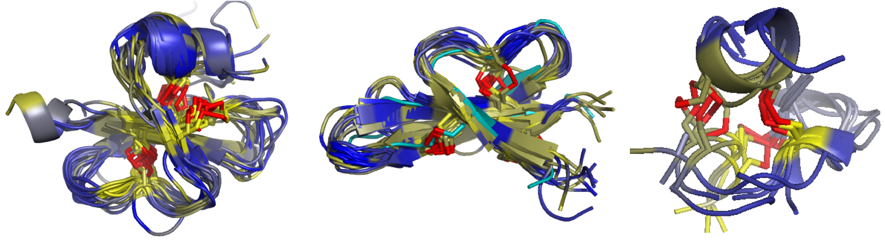

# drp-clusters
This project presents an automated protocol for clustering small disulfide-rich peptides (DRPs) using amino acid sequence and molecular structure features. Applying this protocol on DRPs in the Protein Databank yields insight into their evolution, and also results in a small, diverse set of representative DRPs that provide basis for further bioengineering efforts such as phage display. A detailed description of this approach, as well as its results and experimental application is available in [DT Barkan *et al*, *BMC Bioinformatics*, 2016](https://www.ncbi.nlm.nih.gov/pubmed/27881076). This code is available as supplemental files in that project; it is reproduced here for increased accessibility.



## Prerequisites
- drp-clusters is run with Python 2.7.15 in a 64-bit Linux environment
- [MODELLER libraries](https://salilab.org/modeller/) are required for large components of the software. 

## Installing
- The drpclusters package can be installed using pip:

`pip install drpclusters`

- MODELLER is available for download [here](https://salilab.org/modeller/download_installation.html). If you use the [Ana/Miniconda scientific Python distribution](https://www.continuum.io/downloads), you can install MODELLER as follows:

```conda config --add channels salilab
conda install modeller
```

Other ways to install MODELLER are listed in the above link.

MODELLER is free for academic use provided you [register for a license](https://salilab.org/modeller/registration.html). You will be prompted after installation to edit a file to add your Modeller license key.

If you run MODELLER using the python executable provided with your Conda installation, you may have to tell it where to find drpclusters, as it may ignore your PYTHONPATH. Do this either by specifying a target when installing with pip:

`pip install --target=<conda_root>/lib/python2.7/site-packages/`

todo -- make sure that works

If you install drpclusters elsewhere, it can be imported by your Conda installation as follows:

1. Create the following file: `<conda_root>/lib/python2.7/site-packages/drpclusters.pth`
2. Add one line to this file listing the full path to the drpclusters package: <full_path>/drpclusters/


## Running the drpclusters pipeline
### Overview
Below is a step-by-step guide to running the full pipeline start to finish. The drp-clusters package includes an example set of 100 DRP PDB files for demonstration and testing purposes. Each step below includes the commands to apply the pipeline to this example set of DRPs. 

Most of these steps require using libraries from MODELLER. An exception is step 4, which runs the actual clustering protocol. If you don't have access to MODELLER but want to demo the pipeline, example distance matrix files are also provided. 

In this example, all steps are run in the `drp-clusters/example/` directory, which comes with the input files described in step 1 (using the two-letter PDB directory structure convention).

Many commands are executed with `<condapython>`; this means they should be run with the python executable that comes with your conda distribution and includes MODELLER libraries. (Here, `condapython` is my alias to that executable).

### 1. Compile pipeline input

#### DRP file
Create a file with a list of DRPs, one per line. Each DRP should be represented by its PDB ID and
the chain in the PDB entry associated with the DRP. For example, for the DRP omega-grammotoxin SIA,
which is Chain A in PDB 1KOZ, add the line '1kozA' (no quotes).

#### PDB files
You will need local access to the PDB coordinate files that are listed in the DRP file. This can be structured in one of two ways:

1. Mirrored copy of the PDB - many institutions have a local mirrored copy of the PDB, using the [middle two character directory format](https://www.rcsb.org/pages/download/ftp). If all entries in the DRP list are accounted for here, you're good to go.

2. Alternatively, you can store the PDB entries for all DRPs in your input file in a single directory. They must be named with their standard PDB identifier (xyz case-insensitive?) (i.e. 1koz.pdb).

#### SCOP family file
A mapping of PDB chains to SCOP assignment is also provided (`scop_family_assignment.txt`). This was the final release of SCOP 1.0 in 2009; [SCOP is still being developed](https://scop.berkeley.edu/statistics/ver=2.06), but these knottin assignments were sufficient for the initial clustering protocol.

#### Example
No step is run here, but the PDB files need to be unpacked:

```
tar -xzf dividedPdb.tar.gz
```


todo - optimal column width?
todo - check 1koz case sensitive. Also syntax highlighting

### 2. Finalize PDB input
Run the setup_pdb.py script to extract the coordinates of the DRP chains in each PDB entry and write them out as a separate PDB file. This step also writes out a file mapping DRPs to their sequence lengths (`drp_lengths.txt`), which is needed in step 4.
 
#### Example

```
<condapython> drp-clusters/drpclusters/setup_pdb.py  -q drp_list.txt -p dividedPdbDir/ -l drp_lengths.txt
```

### 3. Align DRP PDB files
The protocol creates pairwise distances matrices using two methods, Native Overlap and Equivalent Disulfides. These matrices must be prepared prior to running the full pipeline. These are ideally prepared on a distributed compute cluster as the computation time scales exponentially, but if there is a tractable number of DRPs, it's possible to use a single CPU  (for reference, 100 DRPs takes xyz on a xyz system). Scripts for both methods are described.

#### Example: Single processor
*This method iterates through all pairs of DRPs in `drp_list.txt` and appends results to the `pairwise.txt` file*
```
<condapython> drp-clusters/drpclusters/pairwise_align.py  -q drp_list.txt -p drpPdb -o pairwise.txt -m full_drp
<condapython> drp-clusters/drpclusters/pairwise_align.py  -q drp_list.txt -p drpPdb -o disulfides.txt -m disulfides
grep longer_fraction pairwise.txt > longerFraction.txt
grep longer_sequence_product pairwise.txt > similarityProduct.txt
grep shorter_fraction pairwise.txt > shorterFraction.txt
```

todo -- decide whether to grep these into 'distances' dir

#### Example: Distributed system
*Alternatively, this method explicitly runs one command for each pair of DRPs. Each pair gets its own output file. To keep things clean, all output is stored in subdirectories. Since each pair of DRPs is processed with a single command, it can be run quickly on a cluster, in accordance with your cluster environment. These example commands only show all-vs-all commands for three DRPs; enumerating across all 100 pairs is left as an exercise to the user*

```
mkdir nativeOverlapWork
mkdir disulfideWork
<condapython> drp-clusters/drpclusters/align_native_overlap.py -f 1b45A -s 1dfnA -p drpPdb -o nativeOverlapWork/1b45A_1dfnA_no.txt
<condapython> drp-clusters/drpclusters/align_native_overlap.py -f 1b45A -s 1hjeA -p drpPdb -o nativeOverlapWork/1b45A_1dfnA_no.txt
<condapython> drp-clusters/drpclusters/align_native_overlap.py -f 1dfnA -s 1hjeA -p drpPdb -o nativeOverlapWork/1b45A_1dfnA_no.txt
<condapython> drp-clusters/drpclusters/align_native_overlap.py -f 1b45A -s 1dfnA -p drpPdb -o nativeOverlapWork/1b45A_1dfnA_no.txt
<condapython> drp-clusters/drpclusters/align_native_overlap.py -f 1b45A -s 1hjeA -p drpPdb -o nativeOverlapWork/1b45A_1dfnA_no.txt
<condapython> drp-clusters/drpclusters/align_native_overlap.py -f 1dfnA -s 1hjeA -p drpPdb -o nativeOverlapWork/1b45A_1dfnA_no.txt
```

*After all individual pairwise distance files have been generated, merge them into a final set of files with the following:*
```
grep longer_fraction nativeOverlapWork/*_no.txt > longerFraction.txt
grep longer_sequence_product nativeOverlapWork/*_no.txt > similarityProduct.txt
grep shorter_fraction nativeOverlapWork/*_no.txt > shorterFraction.txt
```
todo -- decide whether to grep these into 'distances' dir 

### 4. Run Cluster Pipeline
The cluster pipeline performs the following steps:
..* Filters input DRPs by 100% sequence and structure identity
..* Clusters input DRPs by native overlap
..* Reclusters DRPs that have the Knottin SCOP fold by equivalent disulfide bond distance
..* Reassigns longer singletons to more populated clustes

These steps are performed using the distance matrices created above as input.

#### Example
*Note: If you don't have access to MODELLER but nevertheless want to demo the pipeline, distance matrices across the example 100-DRP dataset are also provided (identical to those that would have been generated in the previous steps).*

```
 python drp-clusters/drpclusters/cluster_pipeline.py -r clusterPipeline/ -q drpList.txt -f similarityProduct.txt -n longerFraction.txt -d disulfides.txt -s shorterFraction.txt -c 99 -t .9 -k 2.0 -v 0.01  -b 4 -l 7 -g .7 -e drp_lengths.txt -p allScopFamilies.txt
```

The clustering cutoffs in this example (specified by the `-c`, `-t`, `-k`, `-v`, `-b`, `-l`, and `-g` flags) have been optimized for the 100-DRP dataset. If the input dataset varies, the values of these parameters should be adjusted as described in the [original paper](https://www.ncbi.nlm.nih.gov/pubmed/27881076)


The `drp_lengths.txt` file was created in step 2 above.


xyz say how long various steps take

### 5. Create Visualization Sessions
After the clusters have been created, an optional post-processing step can be run to align all DRPs in each cluster to their respective centroid. This step writes out the aligned PDB coordinates of each DRP for easy viewing in a visualization session (xyz see if this write out the pymol script).

#### Example
```
condapython drp-clusters/drpclusters/cluster_vis_annotation.py -r visAnnotation/ -i 1 2 3 4 5 6 7 8 -c clusterPipeline/processShorterSingletons_cluster_members.txt -l clusterPipeline/processLongerSingletons_singleton_pairs.txt -f clusterPipeline/processShorterSingletons_singleton_pairs.txt -m .7 -p drpDir
```

In this example, the `-i` paramater value specifies which clusters to process and has been optimized for the 100-DRP dataset.


### 6. Cluster Text annotation (coming soon)


## Running the tests
=======
..* Reassigns shorter singletons to more populated clusters

These steps are performed using the distance matrices created above as input.

#### Example
*Note: If you don't have access to MODELLER but nevertheless want to demo the pipeline, distance matrices across the example 100-DRP dataset are also provided (identical to those that would have been generated in the previous steps).*

```
 python drp-clusters/drpclusters/cluster_pipeline.py -r clusterPipeline/ -q drp_list.txt -f similarityProduct.txt -n longerFraction.txt -d disulfides.txt -s shorterFraction.txt -c 99 -t .9 -k 2.0 -v 0.01  -b 4 -l 7 -g .7 -e drp_lengths.txt -p scop_family_assignment.txt
```

The clustering cutoffs in this example (specified by the `-c`, `-t`, `-k`, `-v`, `-b`, `-l`, and `-g` flags) have been optimized for the 100-DRP dataset. If the input dataset varies, the values of these parameters should be adjusted as described in the (original paper xyz (maybe image?)).
>>>>>>> ac78398a6003f318ce7f87efd5bd52e39bb40904

The `drp_lengths.txt` file was created in step xyz above.


xyz say how long various steps take

### 5. Create Visualization Sessions
After the clusters have been created, an optional post-processing step can be run to align all DRPs in each cluster to their respective centroid. This step writes out the aligned PDB coordinates of each DRP for easy viewing in a visualization session (xyz see if this write out the pymol script).

#### Example
```
<condapython> drp-clusters/drpclusters/cluster_vis_annotation.py -r visAnnotation/ -i 1 2 3 4 5 6 7 8 -c clusterPipeline/processShorterSingletons_cluster_members.txt -l clusterPipeline/processLongerSingletons_singleton_pairs.txt -f clusterPipeline/processShorterSingletons_singleton_pairs.txt -m .7 -p drpDir
```

In this example, the `-i` paramater value specifies which clusters to process and has been optimized for the 100-DRP dataset.


### 6. Cluster Text annotation (coming soon)


## License

This project is licensed under the GPLv3 License - see the [LICENSE.txt](LICENSE.txt) file for details

